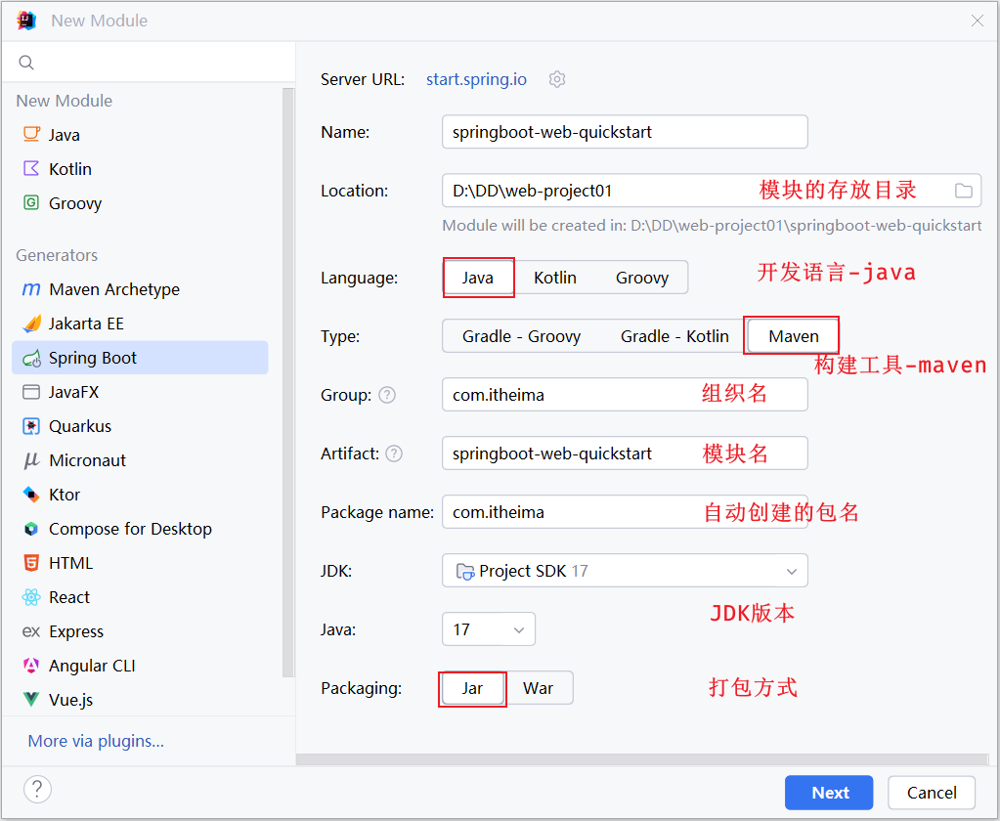
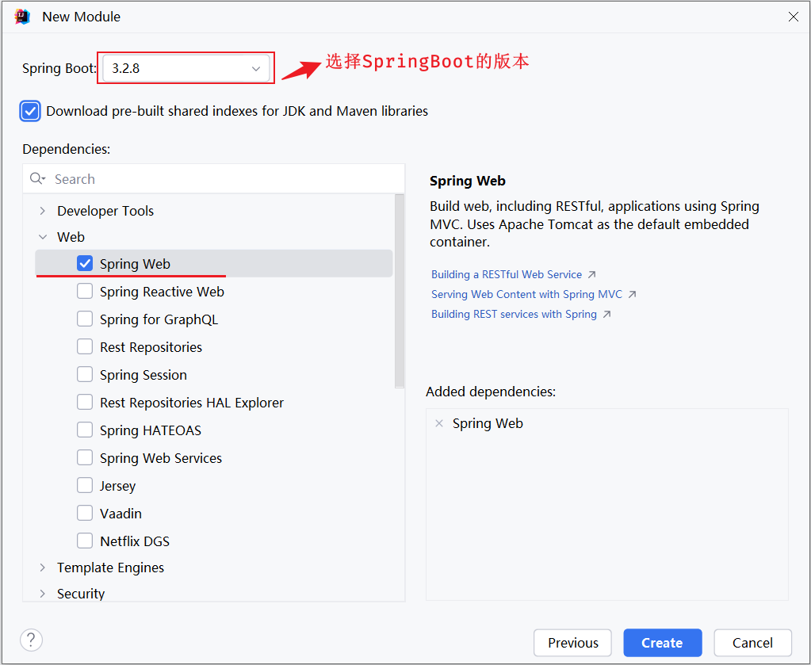

# AI+JavaWeb开发入门

1 链接地址

[全网首发AI+JavaWeb开发入门，Tlias教学管理系统项目实战全套视频教程，从需求分析、设计、前后端开发、测试、程序优化到项目部署一套搞定](https://www.bilibili.com/video/BV1yGydYEE3H/?spm_id_from=333.788.videopod.episodes&vd_source=0a0dd058ef849bffba564af91a70780d&p=32)
2 在线地址

[在线资料](https://heuqqdmbyk.feishu.cn/wiki/KTOKw4PvzipYeIkl3N5cSSxYnPb)

## 2 Maven

### 2.1 Maven-课程介绍

1 什么是Maven?

> Maven是一款用于管理和构建Java项目的工具，是apache旗下的一个开源项目。
>
> Apache Maven 是一个项目管理和构建工具，它基于项目对象模型(Project Object Model ,POM)的概念，通过一小段描述信息来管理项目的构建

2 Maven的作用

> 1 依赖管理
>
>  方便快捷的管理项目依赖的资源（jar包）
>
> 2 项目构建
>
>  标准化的跨平台（Linux、Windows、MacOS）的自动化项目构建方式
>
> 3 统一项目结构
>
>  提供标准、统一的项目结构

3 Maven中的仓库用来存储什么的?

> Maven的仓库是用来存储和管理jar包的

4 Maven中有哪几类仓库? 查找依赖（jar）的顺序是什么样的？

> 本地仓库（1）
>
> 远程仓库（2）
>
> 中央仓库（3）

### 2.2 Maven的安装

1 安装步骤

> 1 解压 apache-maven-3.9.4-bin.zip
>
> 2 配置本地仓库：修改 conf/settings.xml 中的 <localRepository> 为一个指定目录
>
> ```
> <localRepository>D:\develop\apache-maven-3.9.4\mvn_repo</localRepository>
> ```
>
> 3 配置阿里云私服：修改 conf/settings.xml 中的 <mirrors> 标签，为其添加如下子标签
>
> ```
> <mirror>  
>    <id>alimaven</id>  
>    <name>aliyun maven</name>  
>    <url>http://maven.aliyun.com/nexus/content/groups/public/</url>
>    <mirrorOf>central</mirrorOf>          
> </mirror>
> ```
>
> 4 配置环境变量: MAVEN_HOME 为maven的解压目录，并将其bin目录加入PATH环境变量。
>
> 5 测试
>
> ```
> mvn -v
> ```

### 2.3 Maven坐标

1 什么是坐标？

> Maven 中的坐标是资源(jar)的唯一标识，通过该坐标可以唯一定位资源位置。
>
> 使用坐标来定义项目或引入项目中需要的依赖。

2 Maven 坐标主要组成

> 1 groupId：定义当前Maven项目隶属组织名称（通常是域名反写，例如：com.itheima）
>
> 2 artifactId：定义当前Maven项目名称（通常是模块名称，例如 order-service、goods-service）
>
> 3 version：定义当前项目版本号
>
>  SNAPSHOT: 功能不稳定、尚处于开发中的版本，即快照版本
>
>  RELEASE: 功能趋于稳定、当前更新停止，可以用于发行的版本

```xml

<groupId>com.blizx</groupId>
<artifactId>maven-project01</artifactId>
<version>1.0-SNAPSHOT</version>
```

### 2.4 依赖管理

#### 2.4.1 依赖

1 依赖：指当前项目运行所需要的jar包，一个项目中可以引入多个依赖

2 配置

如果不知道依赖的坐标信息，可以到 https://mvnrepository.com/ 中搜索。

> 1.在 pom.xml 中编写 <dependencies> 标签
>
> 2.在 <dependencies> 标签中 使用 <dependency> 引入坐标
>
> 3.定义坐标的 groupId，artifactId，version
>
> 4.点击刷新按钮，引入最新加入的坐标

3 依赖的传递性

所谓maven的依赖传递，指的就是如果在maven项目中，A 依赖了B，B依赖了C，C依赖了D，那么在A项目中，也会有C、D依赖，因为依赖会传递。

4 排除依赖

主动断开依赖的资源，被排除的资源无需指定版本。<exclusions>...</exclusions>

5 注意

一旦依赖配置变更了，记得重新加载

引入的依赖本地仓库不存在，记得联网

```xml

<dependencies>
  <dependency>
    <groupId>org.springframework</groupId>
    <artifactId>spring-context</artifactId>
    <version>6.1.4</version>
    <exclusions>
      <exclusion>
        <groupId>io.micrometer</groupId>
        <artifactId>micrometer-observation</artifactId>
      </exclusion>
    </exclusions>
  </dependency>
</dependencies>
```

#### 2.4.2 Maven的生命周期

1 定义

Maven的生命周期就是为了对所有的maven项目构建过程进行抽象和统一

2 生命周期分类

Maven中有3套相互独立的生命周期

> clean：清理工作。
>
> default：核心工作，如：编译、测试、打包、安装、部署等。
>
> site：生成报告、发布站点等。

在**同一套**生命周期中，当运行后面的阶段时，前面的阶段都会运行

3 常见命令

> clean：移除上一次构建生成的文件
>
> compile：编译项目源代码
>
> test：使用合适的单元测试框架运行测试(junit)
>
> package：将编译后的文件打包，如：jar、war等
>
> install：安装项目到本地仓库

4 执行方式

> 在idea工具右侧的maven工具栏中，选择对应的生命周期，双击执行
>
> 在DOS命令行中，通过maven命令执行

### 2.5 测试(详情看ppt)

## 3 Web后端基础(基础知识)

### 3.1 SpringBootWeb入门

[04-Web后端基础(基础知识)](https://heuqqdmbyk.feishu.cn/wiki/MQ95wDTtji6ob6kiRkyc9jamnwg)

1 作用

> **Spring Boot 可以帮助我们非常快速的构建应用程序、简化开发、提高效率 。**
>
> 而直接基于SpringBoot进行项目构建和开发，不仅是Spring官方推荐的方式，也是现在企业开发的主流。

2 入门程序

> 1 需求
>
>  基于SpringBoot的方式开发一个web应用，浏览器发起请求/hello后，给浏览器返回字符串 "Hello xxx ~"。
>
> 2 步骤
>
>  创建SpringBoot工程，并勾选Web开发相关依赖
> 
> 
> ​3  定义HelloController类，添加方法hello，并添加注解
>
> 1）SpringBootDemo1Application.java
>
> ```java
> package com.blizx;
> 
> import org.springframework.boot.SpringApplication;
> import org.springframework.boot.autoconfigure.SpringBootApplication;
> 
> @SpringBootApplication
> public class SpringBootDemo1Application {
> 
>   public static void main(String[] args) {
>     SpringApplication.run(SpringBootDemo1Application.class, args);
>   }
> 
> }
> 
> ```
>
> 2）HelloController.java
>
> ```java
> package com.blizx.controller;
> 
> import org.springframework.web.bind.annotation.RequestMapping;
> import org.springframework.web.bind.annotation.RestController;
> 
> @RestController
> public class HelloController {
> 
>   @RequestMapping("/hello")
>   public String hello() {
>     System.out.println("Hello World");
>     return "Hello Spring Boot";
>   }
> }
> ```

